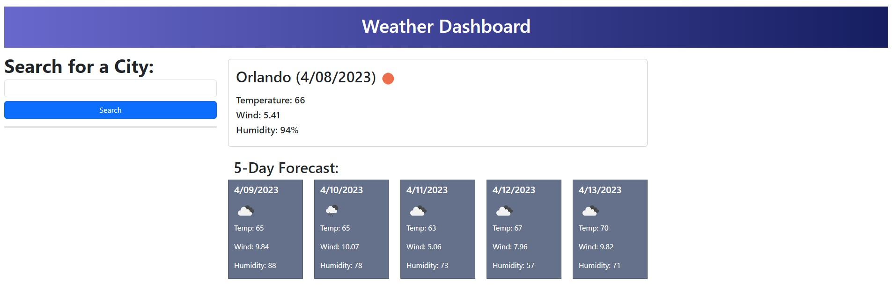
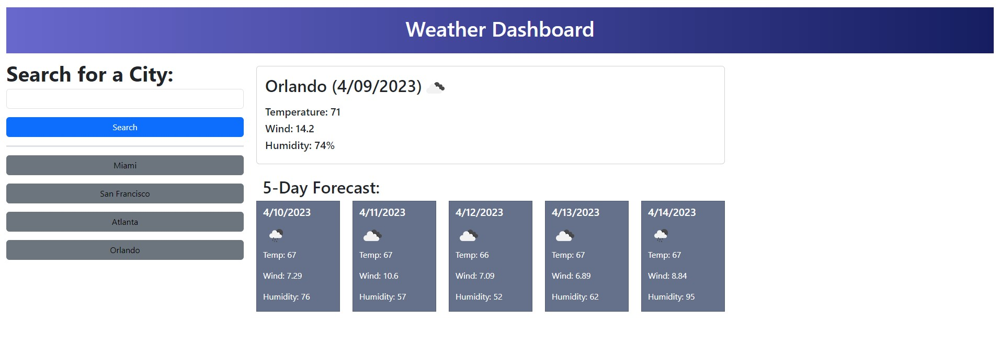

# Weather Dashboard

This is a simple weather dashboard application that utilizes the OpenWeather API to display weather data for a selected city.

## Functionality

The application takes in user input for a city name and makes an API call to retrieve weather data for that city. It then displays the data in two sections:

1. The main weather section which displays the current temperature, wind speed, and humidity for the selected city.
2. The 5-day forecast section which displays the forecasted temperature, wind speed, and humidity for the next 5 days.

The application also stores the user's search history in local storage and allows them to revisit previous searches by clicking on the corresponding button in the search history section.

## Website

[Weather Dashboard](https://robles1999.github.io/weather-forecast-module-6/)

## Technologies Used

- HTML
- CSS
- JavaScript
- jQuery
- OpenWeather API

## Getting Started

To run the application, simply open the `index.html` file in your web browser.

## Credits

This application was created by [Your Name Here] for a coding bootcamp project.
